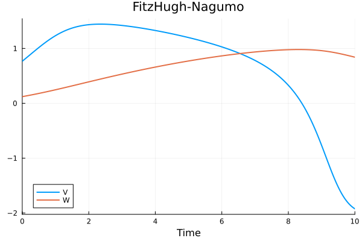
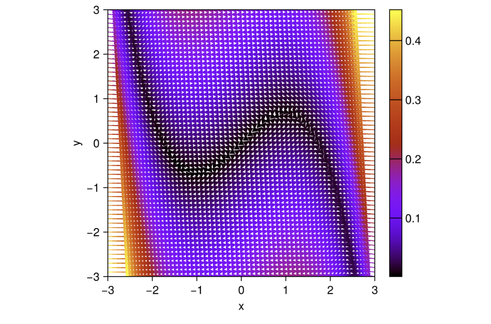

# Building a differentiable model

In this tutorial, we will set up a differentiable FitzHugh-Nagumo model using the `NeuroDynamics` package and plot the phase portrait of the model before training.


```julia
using NeuroDynamics, Lux, Random, Plots, DifferentialEquations, ComponentArrays, Base.Iterators, CairoMakie
```

We will create the model initialized using the default parameters. To change the parameters, we can pass the desired values to the `FitzHughNagumo` constructor.


```julia
rng = MersenneTwister(3)
vector_field = FitzHughNagumo()
model = ODE(vector_field, Tsit5())
p, st = Lux.setup(rng, model) 
p = p |> ComponentArray
```

Setup the initial conditions, inputs and the time span for the simulation. We will set up the input to nothing for now (an unforced system). We will then plot the solution. 


```julia
ts = 0.0:0.1:10.0
x0 = rand(2, 1)
u = nothing
sol = model(x0, u, ts, p, st)[1]
plot(sol, idx=[1,2],  xlabel="Time", title="FitzHugh-Nagumo", label=["V" "W"], linewidth=2)
```


We can also plot the phase portrait of the model using the `phaseplot` function.


```julia
v_ranges = -3.0:0.1:3.0
w_ranges = -3.0:0.1:3.0
x₀_ranges = collect(product(v_ranges, w_ranges))
phaseplot(model, x₀_ranges, u, ts, p, st)
```
